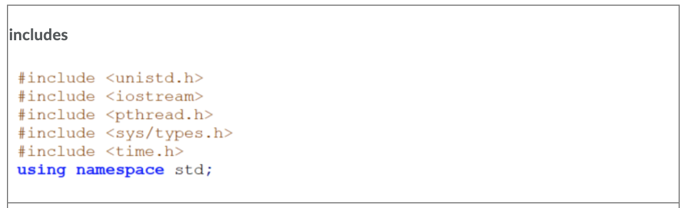
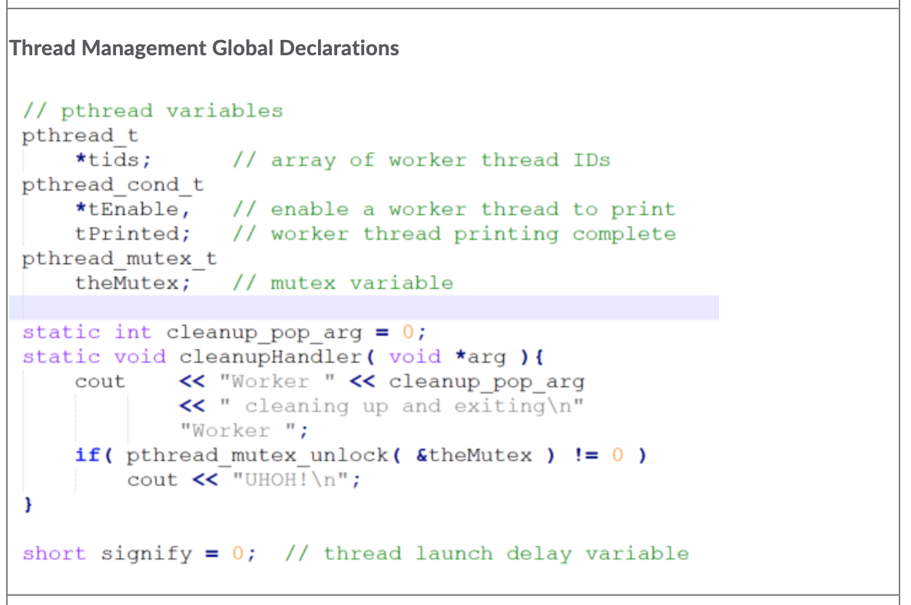
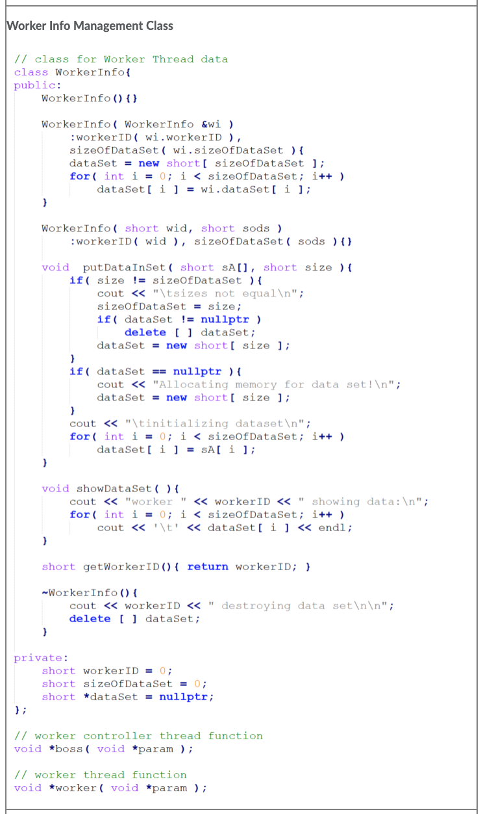
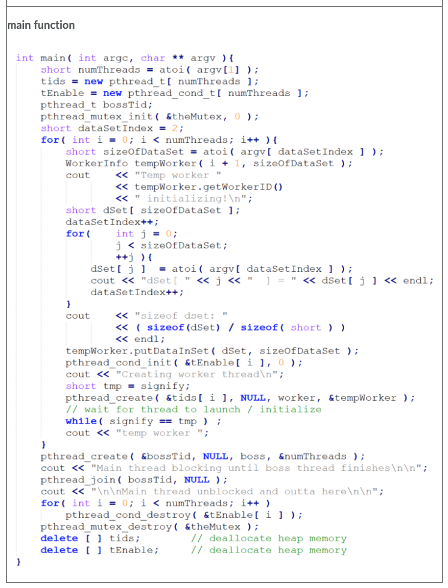
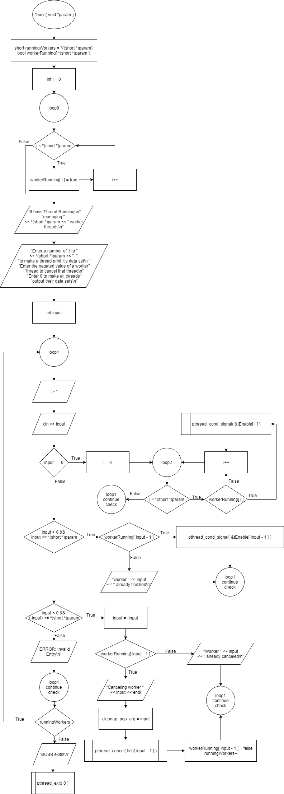
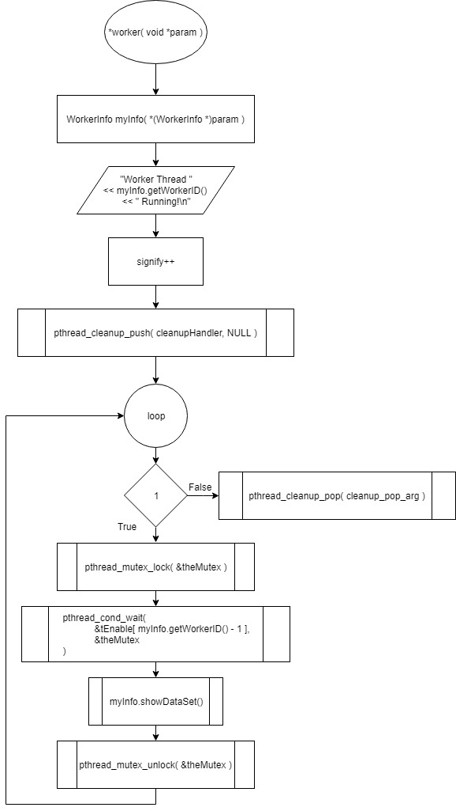

# Lab: Boss and Worker Threads
## This multithreaded program will consist of the following threads:

  Main thread
  Boss thread
  Worker threads

### Launch Program with command line arguments to be interpreted as follows:

1st argument: number of worker sub threads for the main thread to create  
---remaining arguments will be in groups where:  
------Xi, DE0, DE1, ...DEn  
---------Xi: worker i will have X integer Data Elements in it's set  
---------DE0, DE1, ...DEn: set of integer Data Elements from Data Element 0 to Data Element n  
------------each data element will be a short integer  
---Once each worker thread has been created with it's data set, the boss thread will receive a numeric input N through stdin where:  
------absolute value of N must be less than or equal to the number of processes that were created  
---------if 2 workers are created they are worker 1 and worker 2  
------------absolute value of N must be less than or equal to 2  
---if N is positive, boss will signal to worker N making worker N print the data in it's set  
---if N is negative, boss will cancel worker N making worker N print it's worker number and exit  

### Assuming a working program has been compiled into an executable named workers.out, an example usage of the program is detailed as follows:

`./workers.out 2 3 10 11 12 2 100 20`

---Explanation of command line argument tokens:  
------2 (the leftmost 2 ) is the number of workers to be created ( worker 1 and worker 2 )  
------3 is the number of integers worker 1's data set  
---------integers in worker 1's data set are 10, 11, and 12  
------2 is the number of integers in worker 2's data set  
---------integers in worker 2's data set are 100 and 20  
------After Creation of worker threads the boss receives integer inputs through stdin to make the following actions occur  
---------if user inputs 0, all workers will output their data sets  
---------if user inputs 1, worker 1 will output it's data set  
---------if user inputs -1, worker 1 will print it's worker number and exit  
---------if user inputs 2, worker 2 will output it's data set  
---------if user inputs -2, worker 2 will print it's worker number and exit  
------------the user input value is used by boss thread to send a condition signal or cancel request to a worker thread  
---------if a user inputs some integer who's absolute value doesn't correspond to an valid worker thread ID, then print an ERROR message  
------once all worker threads exit, then the boss will exit causing main thread to exit  

## Starter code is given as follows:

## Use the following flow charts to create the boss and worker threads

