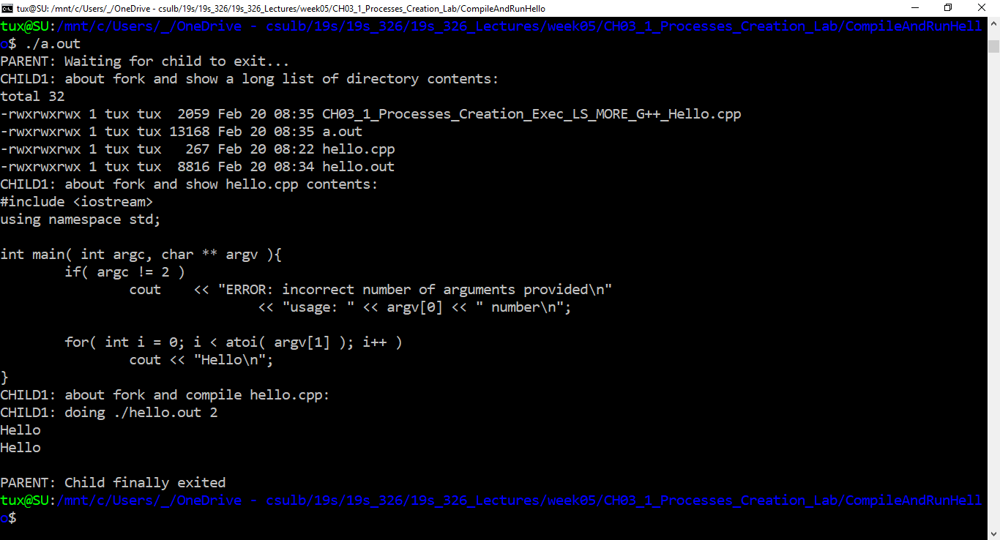

# Lab: fork and exec
## Instructions
create a C++ program which does the following:
* forks and makes the parent wait for its child (child1)
* child1 then forks and waits for it's first child (child2)
* child2 displays a long list of the present working directory contents ( `ls -l` )
* child1 then forks and waits for it's next child (child3)
* child3 displays the contents of hello.cpp ( `more hello.cpp` )
* child1 then forks and waits for it's next child (child4)
* child4 compiles hello.cpp creating hello.out ( `g++ hello.cpp -o hello.out` )
* child1 then runs hello.out passing 2 as command line argument ( `./hello.out 2` )
* parent announces that child has finally exited
Example output of the program run will appear as follows:

